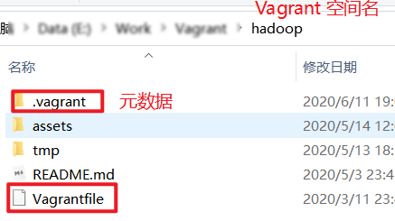

# 迁移 VirtualBox 和 Vagrant 工具
适用场景:
case 1: 别处复制过来 VirtualBox 镜像文件, 想要放到当前电脑的 VirtualBox 中复用;
case 2: VirtualBox 重装了, 旧的虚拟机信息丢失. 但磁盘文件还在, 想要继续使用;


> *概念:*
>
> - VB : VirtualBox
>
> - vbox : VB 列表里看到的虚拟机的抽象表述, 含有两个核心文件: 元数据和磁盘文件. 如: `{虚拟机名}.vbox` 和 `centos-7-1-1.x86_64.vmdk` .
>
> - Vgrant workspace(ws) : vagrant 工作空间, 一个空间可能关联单个虚拟机或多个虚拟机.


vagrant工作空间样例:




两个核心脚本:
1. `migrate_vbox.py` 仅仅迁移 vbox . _通常这已经够用了_.
2. `migrate_vagrant.py` 迁移指定 vagrant workspace 使用到的所有 vbox , 并同步 vagrant id 元数据. **做好 vagrant 和 vbox 的关联**.


## 使用示例

### `migrate_vbox.py`

```
python migrate_vbox.py --vm E:\\Work\\Vagrant\\VMs\\ws-docker --vbxml C:\\Users\\60906\\.VirtualBox\\VirtualBox.xml
# --vm : 虚拟机所在目录, 内含 `.vbox` 和 `.vmdk`(or `.vdi`)
# --vbxml : VB 的元数据xml文件, 默认在用户目录下. 可选.
# python migrate_vbox.py -h 查看help
```
上述脚本是将指定的 vbox 关联(注册)到新的 VB 中. 新 VB 中就可以看到和管理维护旧的虚拟机了. 实现"迁移"的效果.
只要你的 `.vbox` 和 `.vmdk` 文件完好, 位置随意换, VirtualBox 随意重装.

### `migrate_vagrant.py`

```
python migrate_vagrant.py --ws E:\\Work\\Vagrant\\hadoop --vms E:\\Work\\Vagrant\\VMs --vbxml C:\\Users\\60906\\.VirtualBox\\VirtualBox.xml 
# --ws : vagrant 工作空间
# --vms : 多个虚拟机所在的父级目录, 如 VB 默认的存储目录. 脚本会在这里扫描需要的虚拟机, 执行迁移.
# --vbxml : VB 的元数据xml文件, 默认在用户目录下
```
`E:\\Work\\Vagrant\\hadoop` 管理(关联)了一个集群(三个虚拟机) . 上述命令, 将关联的多个虚拟机完成迁移.


## 迁移原理

参见博文: https://juejin.im/post/5ee58c3e518825431000803a
